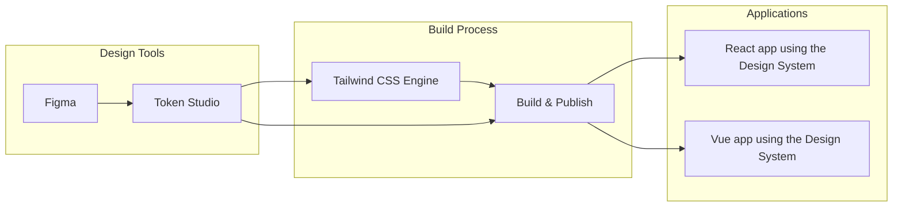

# Kurocado Studio Daily UI

A daily design and development challenge where we create modern, functional UIs using Figma for
design, and implement them in both React and Vue, powered by the
[Kurocado Design System](https://github.com/Kurocado-Studio/design-system). It is meant to sharpen
our UI/UX design skills in Figma and stay hands-on with modern frontend frameworks by translating
designs into functional components using both React and Vue.

## Tech Stack

- **Design**: Figma
- **Frontend**: React + Vue 3
- **Design System**:
  [Kurocado Studio Design System](https://github.com/Kurocado-Studio/design-system)
- **Styling**: TailwindCSS (as per the design system)

Each UI will have:

- A Figma design (linked or embedded)
- A React version
- A Vue version

## Goals

- Improve consistency between design and development
- Learn and apply the Kurocado Studio Design System
- Compare implementation experiences between React and Vue
- Build a growing portfolio of UI components

## Getting Started

### 1. Clone the repo

```bash
git clone https://github.com/Kurocado-Studio/daily-ui.git
cd daily-ui
```

### 2. Install dependencies

```bash
pnpm install
```

### 3. Run locally

```bash
pnpm run dev
```

## Components

Each UI component is added day-by-day and may include forms, cards, dashboards, modals, and more —
each with matching design and code.

## Notes

- All designs are original or inspired by prompts from the
  [Daily UI challenge](https://www.dailyui.co/).
- Design tokens and components follow the Kurocado Design System for consistency and scalability.

## 📷 Previews

> Coming soon — screenshots and Figma embeds.

---

casual or fun tone?

# Kurocado Studio Design System

A token‑driven UI library whose look & feel can be tweaked in Figma and—via Token Studio—propagated
to React components, guaranteeing pixel‑perfect brand consistency without hand‑off friction.

Kurocado Studio’s Design System delivers a single source of truth for typography, color, spacing,
and interaction patterns across web and mobile products. Designers iterate visually in Figma; Token
Studio syncs the updated design tokens to the codebase, and Storybook reflects the changes
instantly—so product teams ship new features faster while staying perfectly on‑brand.

## High Level Overview



## Quick Demo

[](https://youtu.be/RBpAYT4iMuU)

## Documentation

For more information about this Design System’s objectives, features, and success criteria, see the
[Design System Overview](https://kurocado-studio.github.io/platform/design-system.html).
